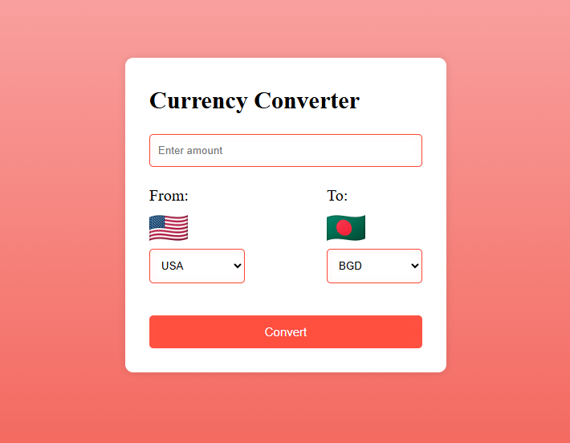

# Currency Converter

A responsive currency converter built with JavaScript that allows users to convert between international currencies using real-time exchange rates and country data from external APIs.

## Live Demo

🚀 Live Application: (https://currency-converter-pi-liart.vercel.app/)

## Preview



## Features

* Real-time currency conversion
* Dynamic country selection
* Automatic flag updates based on selected country
* Exchange rates fetched from a live currency API
* Responsive user interface
* Clean and intuitive design

## Built With

* HTML5
* CSS3
* JavaScript (ES6 Modules)
* REST Countries API
* Currency Exchange API

## Project Structure

```text
currency-converter/
│
├── index.html
├── style.css
├── logic.js
├── data.js
└── assets/
    └── home.png
```

## Getting Started

Clone the repository:

```bash
git clone https://github.com/mrfizz17/currency-converter.git
```

Navigate to the project folder:

```bash
cd currency-converter
```

Open `index.html` in your browser.

## What I Learned

While building this project, I practiced:

* Fetching data from external APIs
* Working with asynchronous JavaScript (`async/await`)
* DOM manipulation
* Dynamic rendering of UI elements
* Working with modules
* Handling user interactions and events

## Future Improvements

* Searchable country dropdowns
* Currency swap functionality
* Improved error handling
* Loading indicators during API requests
* Dark mode support
* Enhanced mobile responsiveness

## Author

Built by MUSTAFIZUR RAHMAN as part of my JavaScript learning journey.
